  

  

  

   

  
  
  

## About me

☁️ Cloud & Backend Engineer building scalable systems with **AWS, Python, and Terraform** 
🌱 Currently exploring **MLOps**, from reproducible pipelines to model monitoring

## Tech stack

  

 

<table width="100%">
  <tr>
    <td align="center" width="50%">
      <strong>☁️ Cloud</strong>
        
      
        
      
      
      
      
      
    </td>
    <td align="center" width="50%">
      <strong>⚙️ Backend</strong>
        
      
        
      
      
      
    </td>
  </tr>
  <tr>
    <td align="center" width="50%">
      <strong>🗄️ Databases</strong>
        
      
        
      
      
    </td>
    <td align="center" width="50%">
      <strong>📦 DevOps</strong>
        
      
        
      
      
    </td>
  </tr>
  <tr>
    <td align="center" width="50%">
      <strong>📈 Observability</strong>
        
      
        
      
      
    </td>
    <td align="center" width="50%">
      <strong>🤖 Automation</strong>
        
      
        
      
      
    </td>
  </tr>
</table>

## Activity

  
  

